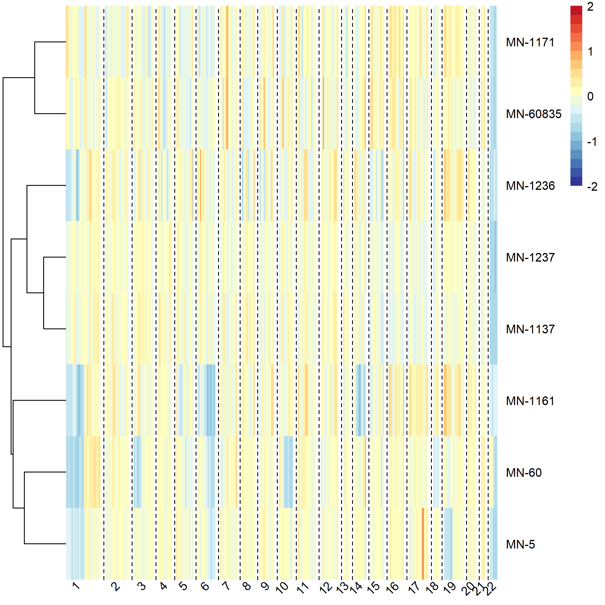
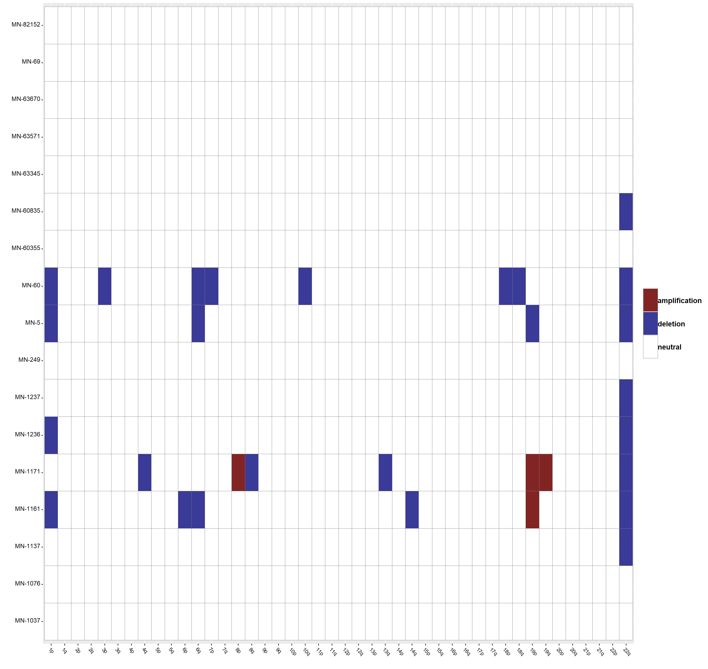
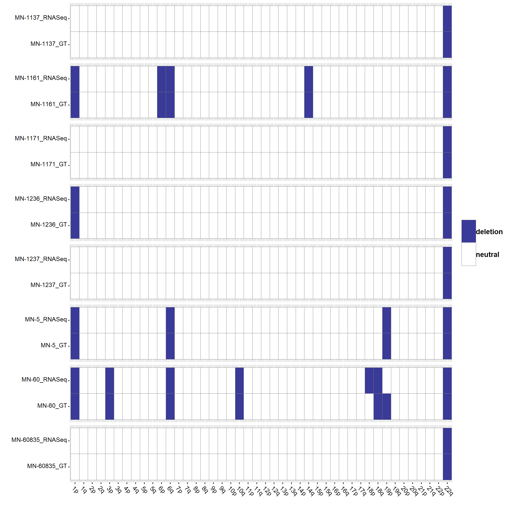
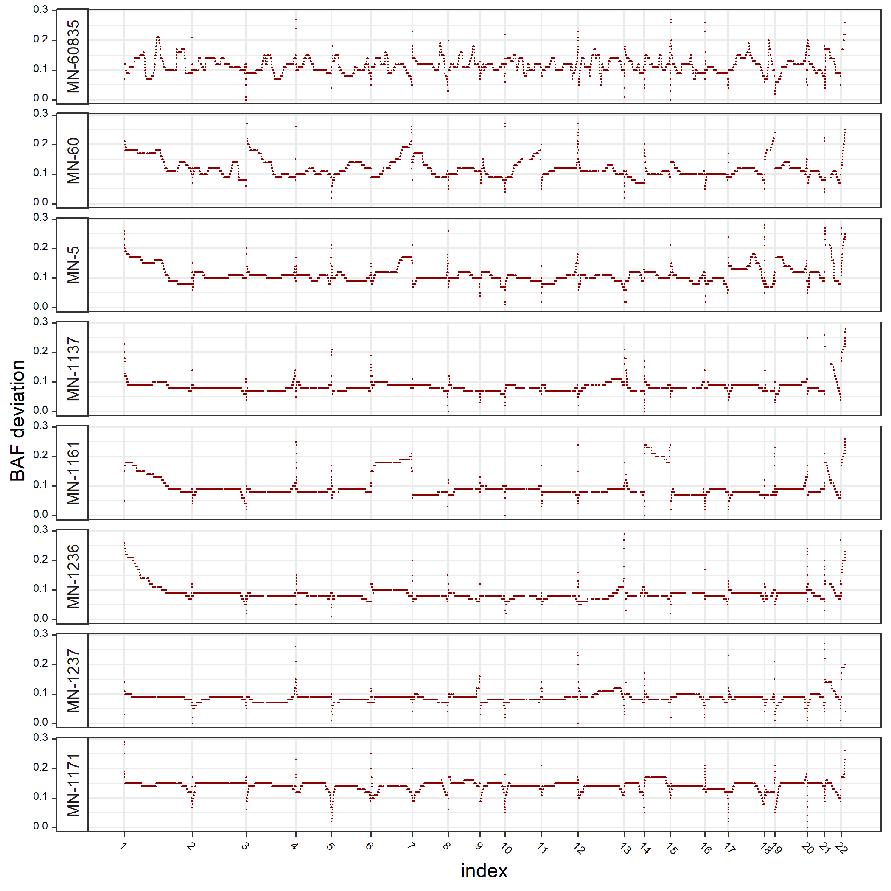
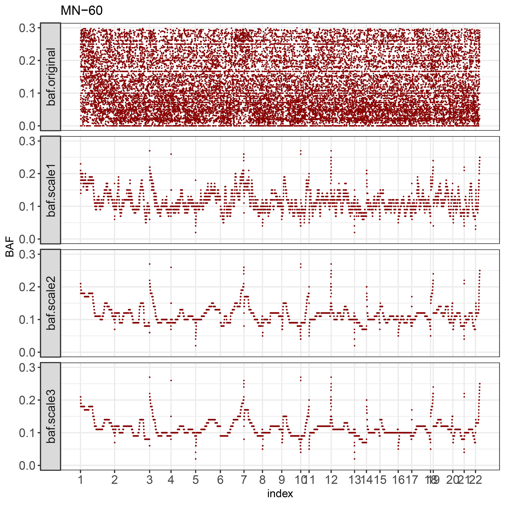
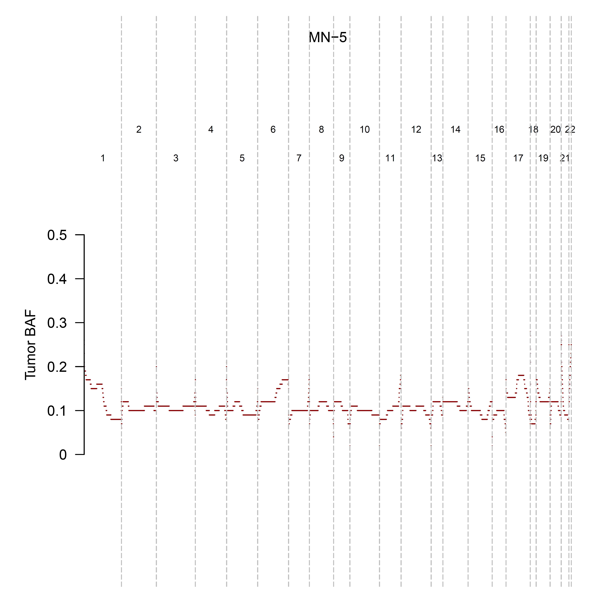
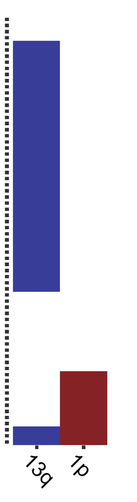
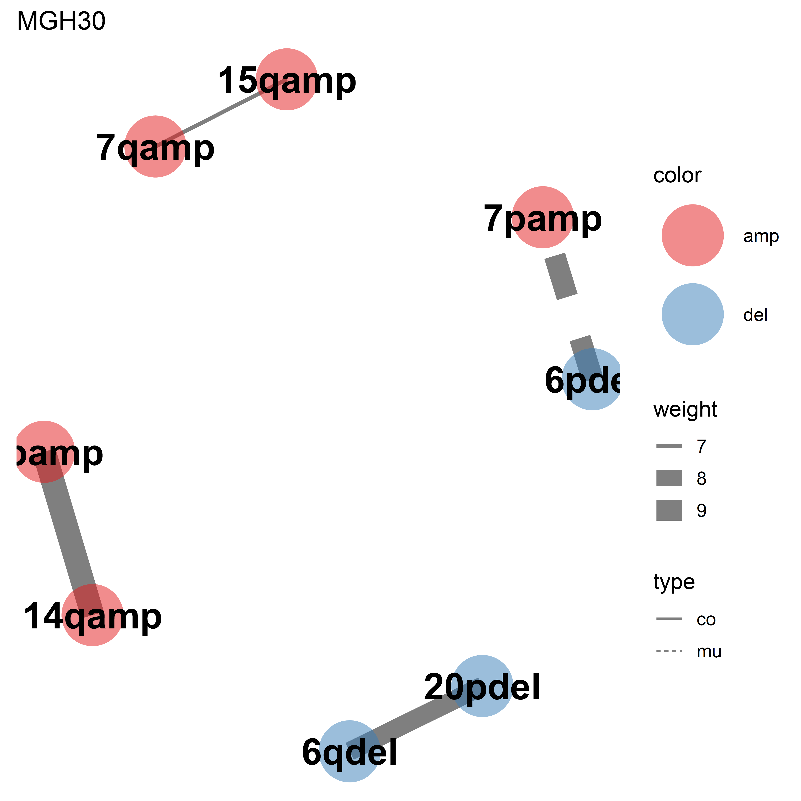

---
title: "CaSpER: Identification, visualization and integrative analysis of CNV events in multiscale resolution using single-cell or bulk RNA sequencing data"
author: "Akdes Serin Harmanci, Arif O. Harmanci"
date: "`r Sys.Date()`"
output: html_document
vignette: >
  %\VignetteIndexEntry{Vignette Title}
  %\VignetteEngine{knitr::rmarkdown}
  %\VignetteEncoding{UTF-8}
---

```{r setup, include = FALSE}
knitr::opts_chunk$set(
  collapse = TRUE,
  comment = "#>"
)
```

CaSpER is a signal processing approach for identification, visualization, and integrative analysis of focal and large-scale CNV events in multiscale resolution using either bulk or single-cell RNA sequencing data.

CaSpER is publicly available from https://github.com/akdess/CaSpER

This vignette shows the basic steps for running CaSpER.

## Installing CaSpER
CaSpER is developed under R version 3.4.3 and updated for 3.6.2

You can install CaSpER R package using the following R commands:

Install dependencies first:

``` r
You may need to install libcurl-devel, libopenssl-devel openssl-devel and libxml2-devel
ex: sudo yum -y install libxml2-devel libcurl-devel libopenssl-devel openssl-devel

source("https://bioconductor.org/biocLite.R")
biocLite(c('biomaRt', 'limma', 'GO.db', 'org.Hs.eg.db', 'GOstats'))

```

For 3.6.2

``` r
BiocManager::install(c('biomaRt', 'limma', 'GO.db', 'org.Hs.eg.db', 'GOstats'))
```

Install CaSpER R package:
``` r
require(devtools)
install_github("akdess/CaSpER")
```

For extracting B-allele frequencies from RNA-Seq bam files download BAFExtract C++ source or binary code from [here](https://github.com/akdess/BAFExtract). 


After downloading  source code type the following: 
``` r
cd BAFExtract
make clean
make

```
The executable is located under directory /bin. 

## Input data

The input to CaSpER consists of aligned RNA-Seq reads and normalized expression matrix. CaSpER uses expression values and B-allele frequencies (BAF) from RNA-Seq reads to estimate CNV events. 

**1. Generation of the allele-based frequency signal from RNA-Seq BAM files:**

BAF shift signal information is extracted directly from the mapped RNA-Seq reads using an optimized BAF generation algorithm. 

Step 1. Merge single cell RNA-Seq bam files (required only for single-cell studies)

```{r, engine = 'bash', eval = FALSE}
   bamtools merge -list <bam_file_names> -out <sample_name>_merged.bam 
   samtools index <sample_name>_merged.bam
```

Step 2. Extract BAF values from RNA-Seq bam files
  
```{r, engine = 'bash', eval = FALSE}
  samtools view <bam_file> | ./BAFExtract -generate_compressed_pileup_per_SAM stdin <genome_list> <sample_dir> 50 0; ./BAFExtract -get_SNVs_per_pileup  <genome_list> <sample_dir> <genome_fasta_pileup_dir> 20 4 0.1 <output_baf_file>
```
sample_dir: the name of sample directory
output_baf_file: final output

You can download and unzip generate genome_fasta_pileup_dir files from: 

[for hg38](https://www.dropbox.com/s/ysrcfcnk7z8gyit/hg38.zip?dl=0)

[for hg19](https://www.dropbox.com/s/a3u8f2f8ufm5wdj/hg19.zip?dl=0)
  
You can download genome_list files from: 

[for hg38](https://www.dropbox.com/s/rq7v67tiou1qwwg/hg38.list?dl=0)
  
[for hg19](https://www.dropbox.com/s/jcmt23nmuzm6poz/hg19.list?dl=0) 

Example run for BAFExtract:

[download example rna-seq bam file](https://www.dropbox.com/s/1vl6iip0b8jwu66/SRR1295366.sorted.bam?dl=0)

```{r, engine = 'bash', eval = FALSE}
mkdir test; samtools view SRR1295366.sorted.bam | ./bin/BAFExtract -generate_compressed_pileup_per_SAM stdin hg38.list test 50 0; ./bin/BAFExtract -get_SNVs_per_pileup hg38.list test ./hg38/ 20 4 0.1 test.baf
```

**2. Normalized gene expression data** 

The expression values can be normalized using  TPM or FPKM or raw. Below is an example normalized gene expression input :
```{r, include=FALSE}
library(knitr)
```

```{r eval=T, message=FALSE, warning=FALSE}
library(CaSpER)
data (yale_meningioma)
kable(yale_meningioma$data[1:5, 1:5])

```

Normalized gene expression matrix rows represents genes either with ensembl gene id or hgnc gene symbol. Columns represent samples or cells. 

Cytoband information can be downloaded from UCSC. 
``` r
http://hgdownload.cse.ucsc.edu/goldenPath/hg19/database/cytoBand.txt.gz
```

```{r, eval=T}
data(hg19_cytoband)
kable(cytoband[1:5, ])
```

HG38 cytoband information can be generated using the following commands:

First cytoband information can be downloaded from UCSC. 

``` r
http://hgdownload.cse.ucsc.edu/goldenPath/hg38/database/cytoBand.txt.gz
```

```{r, eval=F}
cytoband <- read.delim("cytoBand.txt", header=F)
cytoband <- data.frame(V1=gsub("chr", "", cytoband[,1]), V2=cytoband[,2], V3=cytoband[,3], V4=substring(cytoband$V4, 1, 1), stringsAsFactors=F)
start <- do.call(rbind, lapply(split(cytoband$V2, paste0(cytoband$V1, cytoband$V4)), min))
end <- do.call(rbind, lapply(split(cytoband$V3, paste0(cytoband$V1, cytoband$V4)), max))
cytoband <- data.frame(V1=gsub("p", "", gsub("q", "", rownames(start))), V2=start, V3=end, V4=rownames(start), stringsAsFactors=F)
cytoband <- cytoband [as.vector(unlist(sapply(c(1:22, "X"), function(x) which(cytoband$V1 %in% x)))), ]
cytoband$V4[grep("q", cytoband$V4)] <- "q"
cytoband$V4[grep("p", cytoband$V4)] <- "p"
rownames(cytoband) <- NULL
```


Centromere information can be downloaded from UCSC. 
``` r
#curl -s "http://hgdownload.cse.ucsc.edu/goldenPath/hg19/database/cytoBand.txt.gz" | gunzip -c | grep acen | head
```


Annotation data which contains the positions of each gene along each chromosome in the genome can be generated using the following  functions: 


```{rannotation <- generateAnnotation(id_type="ensembl_gene_id", genes=rownames(yale_meningioma$data), ishg19=T, centromere, host="uswest.ensembl.org")
```

```{r, include=FALSE}
annotation <- yale_meningioma$annotation
```

```{r, eval=T}
kable(annotation[1:5, ])
```

BAFExtract output files are read using the following functions:

```{r, eval=F}
loh <- readBAFExtractOutput ( path="./meningioma_baf\\", sequencing.type="bulk")
names(loh) <- gsub(".snp", "", names(loh))
```

##Identifying CNV events 
The main functions you will need to use to identify CNV events are CreateCasperObject() and runCaSpER(casper_object).

**1. Creating casper object**

The casper object is required for performing CNV analysis on single-cell and bulk RNA-Seq. 
Casper object is created using following functions 

```{r, eval=F}
object <- CreateCasperObject(raw.data=data,loh.name.mapping=loh.name.mapping, sequencing.type="bulk", 
  cnv.scale=3, loh.scale=3, matrix.type="normalized", expr.cutoff=4.5,
  annotation=annotation, method="iterative", loh=loh, filter="median",  
  control.sample.ids=control.sample.ids, cytoband=cytoband)
```

Above CaSpER object  stores all information associated with the dataset, including expression data, smoothed expression data in n (default:3) different scales, original baf signal, smoothed baf signal,  annotations, control sample ids.

loh.name.mapping: contains the sample id mappings between expression signal and baf signal. For bulk sequencing data there will be one to one mapping since baf signal is generated for all samples seperately. 

```{r, eval=T}
kable(yale_meningioma$loh.name.mapping[1:5, ])
```

However, in single-cell sequencing data there will be one to multiple mapping since baf signal is generated after pooling all the cells coming from the same patient. 

```{r, eval=T}
data("scell_gbm")
kable(scell_gbm$loh.name.mapping[1:5, ])
```

control.sample.ids is the vector of control samples.

**2. Pairwise comparison of scales from BAF and expression signals** 

After creating the casper object we perform HMM on all scales of expression signal and integrate HMM segment states with Allele Frequency Shift Information. CaSpER algorithm outputs CNV calls using all the pairwise comparisons of expression signal and BAF signal decompositions. 

```{r, eval=F}
final.objects <- runCaSpER(object, removeCentromere=T, cytoband=cytoband, method="iterative")
```


**3. Harmonization and Summarization of CNV calls from multiple scales and from multiple pairwise comparison of BAF and Expression Signals**

The pairwise comparison and assignment of CNV calls generates a large number of per-scale information that must be summarized such that each position of the genome is assigned a final call about its CNV status, i.e., deletion/amplification/neutral. We use a consistency-based approach for harmonizing the pairwise comparisons: The events are put together and we assign the final CNV for a gene or large-scale event if the CNV calls are consistent among at least a certain number of pairwise scale comparisons. CaSpER harmonizes and summarizes the CNV calls by dividing them into large-scale, gene-based, and segment-based CNV calls 

a. Large-Scale CNV Summarization. 

We assign a large-scale CNV call to every chromosome arm for each of the  N×M pairwise scale comparisons. Next, for each chromosome arm, we ask whether the large-scale CNV call is consistent among at least γ of the N×M large-scale CNV calls. N denotes the index for the highest smoothing scale for expression signal. M denotes the index for the highest smoothing scale for baf signal. thr represents minimum percentage, 75\% (at least 7 out of 9 scales),  of consistent CNV calls (Out of N×M comparisons of expression scales and BAF scales) while assigning a final CNV (amp/del/neutral) call to a segment/gene/chromosome arm. 


```{r, eval=F}
finalChrMat <- extractLargeScaleEvents (final.objects, thr=0.75) 
``` 


b. Segment based CNV Summarization. 

The segments-based summarization aims at generating a final set of CNV calls for a final set of segments that are computed by comparison of scales. We first compare the segments from different expression scales and generate the consistent set of segments. For each segment in the final set, if there are more than γ (default=6) consistent CNV calls among N×M CNV calls, we assign the consistent CNV call to segment. When there is no consistency among the calls, we assign a neutral CNV state to segment.

```{r, eval=F}
gamma <- 6
all.segments <- do.call(rbind, lapply(final.objects, function(x) x@segments))
segment.summary <- extractSegmentSummary (final.objects)
loss <- segment.summary$all.summary.loss
gain <- segment.summary$all.summary.gain
loh <- segment.summary$all.summary.loh
loss.final <- loss[loss$count>gamma, ]
gain.final <- gain[gain$count>gamma, ]
loh.final <- loh[loh$count>gamma, ]
``` 

c. Gene based CNV Summarization. 

Similar to the large-scale summarization, we generate a matrix where rows are the samples (cells) and columns are the genes. The matrix entry of 0 corresponds to no alteration, 1 corresponds to amplification and -1 corresponds to deletion. If an alteration is consistent in more than γ scale comparisons (out of N×M comparisons), we report that alteration event for that sample. 

```{r, eval=F}
all.summary<- rbind(loss.final, gain.final)
colnames(all.summary) [2:4] <- c("Chromosome", "Start",   "End")
rna <-  GRanges(seqnames = Rle(gsub("q", "", gsub("p", "", all.summary$Chromosome))), 
    IRanges(all.summary$Start, all.summary$End))   
ann.gr <- makeGRangesFromDataFrame(final.objects[[1]]@annotation.filt, keep.extra.columns = TRUE, seqnames.field="Chr")
hits <- findOverlaps(geno.rna, ann.gr)
genes <- splitByOverlap(ann.gr, geno.rna, "GeneSymbol")
genes.ann <- lapply(genes, function(x) x[!(x=="")])
all.genes <- unique(final.objects[[1]]@annotation.filt[,2])
all.samples <- unique(as.character(final.objects[[1]]@segments$ID))
rna.matrix <- gene.matrix(seg=all.summary, all.genes=all.genes, all.samples=all.samples, genes.ann=genes.ann)
``` 

**4.Visualization**

In order to comprehensively visualize the CNV events, CaSpER first generates visuals that combine all the samples so that user can view the events jointly over all samples and co-occurrence and mutually exclusive patterns can be visually inspected. To characterize these patterns, CaSpER performs clustering of samples and clustering of detected CNVs and generates clustering plots. We summarize these visualizations below.

a. plotHeatmap: Visualization of the genomewide gene expression signal plot at different smoothing scales 
CaSpER outputs the expression signal at different scales. In these plots, each row is a sample and the columns are the chromosomes. These can be useful for comparison of outputs from different scales using the panoramic inspection of the expression signal.

```{r, eval=F}
obj <- final.objects[[9]]
plotHeatmap(object=obj, fileName="heatmap.png",cnv.scale= 3, cluster_cols = F, cluster_rows = T, show_rownames = T, only_soi = T)
```
 
```{r, echo=FALSE, out.width = '50%'}

```

b. plotLargeScaleEvent: Visualization of the large-scale CNV events among all the samples/cells.
Large scale event summarization is useful for summarizing the detected large-scale CNV events (deletions and amplifications) over multiple samples. This plot summarizes the large scale CNVs and may reveal the patterns that may otherwise be missed when data is visualized at smaller scales.

```{r, eval=F}
plotLargeScaleEvent (object=obj, fileName="large.scale.events.png") 
``` 
```{r, echo=FALSE, out.width = '50%'}

```

c. plotGEAndGT: Plot large scale events called from genotyping and RNA-Seq (can be used only with small sample size)

```{r, eval=F}
plotGEAndGT (chrMat=finalChrMat, genoMat=genoMat, fileName="RNASeqAndGT.png")
``` 
```{r, echo=FALSE, out.width = '50%'}

```

c. plotBAFAllSamples: Visualization of BAF shift signal for all samples together. 
The inspection of BAF shift signal is useful especially when compared to the expression signal to analyze the CNV and LOH events. The BAF shift plots show the BAF shift signal such that each row is the genomewide BAF shift signal profile. 

```{r, eval=F}
plotBAFAllSamples (loh = obj@loh.median.filtered.data,  fileName="LOHAllSamples.png") 
``` 

```{r, echo=FALSE, out.width = '50%'}

```

d. plotBAFOneSample: plotBAFOneSample: Visualization of BAF shift signal in different scales for one sample.
This option plots the BAF shift signal for one sample at different scales. Similar to the multiscale smoothing of expression signal, this information enables panoramic assessment and identification of CNV and LOH events. 

```{r, eval=F}
plotBAFOneSample (object, fileName="LOHPlotsAllScales.pdf") 
``` 

```{r, echo=FALSE, out.width = '50%'}

```

e. plotBAFInSeperatePages: Visualization of BAF deviation for each sample in separate pages. This option creates the BAF shift signal for each sample separately. This way the user can visualize each sample by itself. 

```{r, eval=F}
plotBAFInSeperatePages (loh=obj@loh.median.filtered.data, folderName="LOHPlots") 
```

```{r, echo=FALSE, out.width = '50%'}

```

f. plotGEAndBAFOneSample: Gene expression and BAF signal for one sample in one plot. This option generates the visualization of the gene expression signal and BAF shift signal together so that the user can jointly assess them in one page.

```{r, eval=F}
plotGEAndBAFOneSample (object=obj, cnv.scale=3, loh.scale=3, sample= "MN-5")
```

```{r, echo=FALSE,  out.width = '50%'}
knitr::include_graphics("MN-5_GE_BAF.png")
```

**Visualization options specific for single-cell RNA-Seq data **
g. plotSingleCellLargeScaleEventHeatmap: Visualization of large scale event summary for selected samples and chromosomes.
This option generates a heatmap view of only the detected large-scale CNV events over all samples. In this plot, the rows correspond to the samples and columns correspond to the detected large scale CNV events. This plot aims at providing the user with a way to visually inspect the large-scale event summaries, i.e. co-occurrence and exclusivity patterns. An example of this heatmap is shown below.

```{r, eval=F}
plotSingleCellLargeScaleEventHeatmap(finalChrMat, sampleName="MGH31", chrs=c("5p", "14q"))
```
```{r, echo=FALSE,  out.width = '10%'}

```

h. plotMUAndCooccurence: Visualization of mutually exclusive and co-occuring events.

```{r, eval=F}
## calculate significant mutual exclusive and co-occurent events
results <- extractMUAndCooccurence (finalChrMat, loh, loh.name.mapping)
## visualize mutual exclusive and co-occurent events
plotMUAndCooccurence (results)

```
```{r, echo=FALSE,  out.width = '50%'}

```

i. plotSCellCNVTree: Pyhlogenetic tree-based clustering and visualization of the cells based on the CNV events from single cell RNA-seq Data.


Tutorials
----------

1. [Yale meningioma Bulk RNA-Seq dataset](https://github.com/akdess/CaSpER/blob/master/demo/meningioma.R)
2. [TCGA-GBM Bulk RNA-Seq dataset](https://github.com/akdess/CaSpER/blob/master/demo/tcga_GBM.R)
2. [TCGA-BRCA Bulk RNA-Seq dataset](https://github.com/akdess/CaSpER/blob/master/demo/tcga_BRCA.R)
3. [GBM Single-cell RNA-Seq dataset](https://github.com/akdess/CaSpER/blob/master/demo/sCellGBM.R)


Each run generally takes about 5-20 minutes. 


